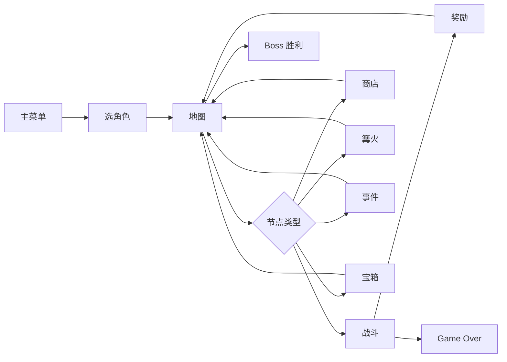

# X-card 搭建与内容填充指南

本文档说明 Demo 框架的目录结构、内容配额、数据格式与部署方式。引擎与 UI 已就绪，**卡牌、敌人、事件等具体内容由你自行设计并放入对应目录**。

---

## 1. 技术栈

| 项目 | 选型 |
|------|------|
| 语言 | TypeScript |
| 构建 | Vite 6 |
| 渲染 | 原生 DOM（无 React/Vue） |
| 部署 | GitHub Pages + GitHub Actions |

---

## 2. 目录结构总览

```
X-card/
├── .github/workflows/deploy.yml   # 自动部署到 GitHub Pages
├── docs/SETUP.md                  # 本指南
├── index.html                     # 页面入口
├── package.json
├── vite.config.ts                 # base 路径（GitHub Pages 子路径）
├── tsconfig.json
└── src/
    ├── main.ts                    # 应用启动（勿改，除非加全局初始化）
    ├── styles/main.css            # 全局样式（可扩展）
    │
    ├── content/                   # ★ 你的游戏内容放这里
    │   ├── loader.ts              # 内容加载入口（已 import 各模块）
    │   ├── characters/            # 角色（Demo：1 个）
    │   ├── cards/                 # 卡牌（Demo：~30 张）
    │   ├── relics/                # 遗物（Demo：20 个）
    │   ├── enemies/               # 敌人（10 普通 + 3 精英 + 3 Boss）
    │   ├── potions/               # 药水
    │   ├── events/                # 事件（Demo：20 个）
    │   └── map/config.ts          # 地图生成权重与层结构
    │
    ├── core/                      # 引擎核心（一般不需改）
    │   ├── GameManager.ts         # 游戏状态机与流程
    │   ├── EventBus.ts            # 遗物/能力触发时机
    │   ├── constants.ts           # 全局数值平衡
    │   └── registries/            # 内容注册表
    │
    ├── entities/                  # 类型定义（扩展机制时参考）
    ├── systems/                   # 战斗、地图、商店、奖励等逻辑
    ├── ui/                        # 界面屏幕与组件
    └── utils/                     # 随机、洗牌等工具
```

---

## 3. Demo 内容配额与文件位置

| 模块 | 目标数量 | 放置位置 | 注册方式 |
|------|----------|----------|----------|
| 角色 | 1 | `src/content/characters/` | 在 `index.ts` 中 `registerCharacter()` |
| 卡牌 | ~30 | `src/content/cards/` | 在 `index.ts` 中 `registerCards([...])` |
| 遗物 | 20 | `src/content/relics/` | `registerRelics([...])` |
| 普通敌人 | 10 | `src/content/enemies/` | `registerEnemies([...])`，`tier: 'normal'` |
| 精英敌人 | 3 | 同上 | `tier: 'elite'` |
| Boss | 3 | 同上 | `tier: 'boss'` |
| 事件 | 20 | `src/content/events/` | `registerEvents([...])` + `registerOutcomes([...])` |
| 药水 | 按需 | `src/content/potions/` | `registerPotions([...])` |
| 地图 | 1 套 | `src/content/map/config.ts` | 修改 `mapConfig` |
| 数值平衡 | — | `src/core/constants.ts` | 能量、奖励金币、商店价格等 |

### 3.1 推荐的内容拆分方式

内容较少时，全部写在各目录的 `index.ts` 即可。数量增多后建议：

```
src/content/cards/
├── index.ts          # 汇总 import 并 registerCards
├── basic.ts          # 基础牌（打击/防御等）
├── common.ts
├── uncommon.ts
└── rare.ts

src/content/enemies/
├── index.ts
├── normal.ts         # 10 个普通怪
├── elite.ts          # 3 个精英
└── boss.ts           # 3 个 Boss

src/content/events/
├── index.ts
├── outcomes.ts       # 所有 EventOutcome 定义
└── events.ts         # 20 个 EventDefinition
```

**规则：** 无论拆成多少文件，最终必须在对应 `index.ts` 里完成注册，并在 `src/content/loader.ts` 中保持 import（loader 已 import 各 index）。

---

## 4. 数据格式速查

### 4.1 角色 `CharacterDefinition`

文件：`src/entities/Character.ts`

```typescript
{
  id: 'your_hero',
  name: '角色名',
  title: '称号',
  maxHp: 70,
  startingGold: 99,
  startingDeck: ['strike', 'strike', 'defend', ...],  // 卡牌 definition id
  startingRelics: ['worn_charm'],
  description: '背景描述',
  color: '#6b9bd1',  // UI 主题色
  _design: { purpose, archetypes, risks, balance },  // 可选，设计备忘
}
```

### 4.2 卡牌 `CardDefinition`

文件：`src/entities/Card.ts`

- `type`: `'attack' | 'skill' | 'power'`
- `rarity`: `'basic' | 'common' | 'uncommon' | 'rare'`
- `effects`: `{ damage?, block?, draw?, energy?, applyStatus?, custom? }`
- `characterId`: 限定角色专属牌；`null` 表示通用
- `upgrade`: 篝火升级后的数值/描述
- `exhaust` / `innate`: 消耗牌 / 固有牌标记

引擎当前支持的打牌效果：`damage`、`block`、`draw`、`energy`、简单 `applyStatus`。复杂效果用 `custom` 字符串 + 后续在 `CombatSystem` 扩展。

### 4.3 遗物 `RelicDefinition`

文件：`src/entities/Relic.ts`

- `trigger`: `'battle_start' | 'turn_start' | 'on_play_card' | ...`（见类型）
- `effect`: `{ value?, target?, custom? }`
- 复杂逻辑：订阅 `src/core/EventBus.ts` 的 `GameEvents`，或在 `RelicRegistry` 旁增加 handler 映射

### 4.4 敌人 `EnemyDefinition`

文件：`src/entities/Enemy.ts`

- `tier`: `'normal' | 'elite' | 'boss'`
- `moves[]`: 循环行为模式；每项含 `intents`（UI 显示）与 `actions`（实际效果）

### 4.5 事件

文件：`src/entities/Event.ts`

1. 先 `registerOutcomes([{ id, type, value, description }])`
2. 再 `registerEvents([{ id, title, description, choices: [{ id, text, outcomes: ['outcome_id'] }] }])`

Outcome 类型：`gain_gold`、`lose_hp`、`gain_card`、`gain_relic`、`custom` 等。

### 4.6 地图 `mapConfig`

文件：`src/content/map/config.ts`

- `floors`: 层数（Demo 默认 15）
- `nodeWeights`: 各节点类型随机权重
- `guaranteedNodes`: 指定层固定节点（如第 5 层篝火）
- `eliteFloors`: 可出现精英的层
- `bossFloor`: Boss 所在层

---

## 5. 游戏流程（引擎已实现）



核心状态机：`src/core/GameManager.ts`  
战斗逻辑：`src/systems/combat/CombatSystem.ts`  
奖励生成：`src/systems/combat/CombatSystem.ts`（胜利时）+ `src/systems/rewards/RewardSystem.ts`

---

## 6. 数值与平衡调参

编辑 `src/core/constants.ts`：

| 常量 | 含义 |
|------|------|
| `GAME.BASE_ENERGY` | 每回合能量 |
| `GAME.DRAW_PER_TURN` | 回合抽牌数 |
| `GAME.CARD_REWARD_COUNT` | 战后卡牌三选一数量 |
| `GAME.POTION_DROP_CHANCE` | 药水掉落概率 |
| `REWARD_GOLD` | 普通/精英/Boss 金币范围 |
| `SHOP_PRICES` | 商店价格区间 |
| `CAMPFIRE.HEAL_RATIO` | 篝火休息恢复比例 |
| `MAP.*` | 地图层数、精英数量等 |

---

## 6.1 参数修改说明

以下文件是本项目最常修改的参数位置：

- `src/content/characters/index.ts`
  - 修改角色 `name`、`title`、`description`、`maxHp`、`startingGold`、`startingDeck`、`startingRelics`、`color`、`portrait`。
  - `portrait` 是角色头像路径，相对 `public/`，如 `assets/characters/fluxbreaker.png`。
- `src/content/cards/index.ts`
  - 修改卡牌 `name`、`type`、`rarity`、`cost`、`description`、`effects`、`upgrade`、`image`、`imageUpgraded`。
  - `image` 和 `imageUpgraded` 路径相对 `public/`，例如 `assets/cards/your_card.png`。
  - `effects` 支持 `damage`、`block`、`draw`、`energy`、`applyStatus`、`custom`。
- `src/content/relics/index.ts`
  - 修改遗物 `name`、`rarity`、`description`、`trigger`、`effect`、`handler`。
  - `effect` 常用字段为 `value`、`target`、`custom`。
- `src/content/enemies/index.ts`
  - 修改敌人 `name`、`tier`、`maxHp`、`moves`。
  - 每个 `move` 的 `intents` 控制 UI 展示，`actions` 控制实际效果。
- `src/content/events/index.ts`
  - 修改事件 `title`、`description`、`choices`。
  - `options` 对应 `outcomes` 的结果；可在 `registerOutcomes` 中添加更多类型。
- `src/content/potions/index.ts`
  - 修改药水 `name`、`description`、`effect`。
- `src/content/map/config.ts`
  - 修改 `floors`、`pathsPerFloor`、`nodeWeights`、`guaranteedNodes`、`eliteFloors` 和 `bossFloor`。
- `src/core/constants.ts`
  - 修改全局数值，如 `GAME.BASE_ENERGY`、`REWARD_GOLD`、`SHOP_PRICES`、`POTION_DROP_CHANCE`、`CAMPFIRE.HEAL_RATIO`。

> 这些字段均可直接编辑，适合快速迭代数值与文本。不需要改动引擎代码即可完成大部分设计调整。

---

## 7. 设计备忘字段 `_design`

每种内容类型都支持可选 `_design` 对象，用于记录（不参与运行时逻辑）：

- **purpose** — 设计目的
- **archetype / archetypes** — 适配流派
- **risks** — 潜在风险
- **balance** — 平衡建议

填写这些字段可在开发期快速回顾设计意图，无需另建表格。

---

## 8. 本地开发

```bash
npm install
npm run dev        # http://localhost:5173/X-card/
npm run build      # 输出到 dist/
npm run preview    # 预览生产构建
npm run typecheck  # 仅类型检查
```

---

## 8. UI 配置面板

本项目新增了一个“UI 配置”面板，可直接在运行时调整卡牌手牌布局与悬停交互体验。

- 打开任意游戏界面后，页面底部会显示“UI 配置”面板
- 可以调节：
  - 卡牌间距
  - 卡牌悬停缩放
  - 卡牌悬停抬起高度
  - 卡牌悬停旋转角度
  - 禁用卡牌透明度
- 调整后效果会立即生效，无需刷新页面
- 配置主要作用于 `src/styles/main.css` 中的卡牌交互样式变量

如果希望将该功能扩展为持久化配置，可在 `src/ui/components/UiConfigPanel.ts` 中添加 `localStorage` 读写逻辑。

---

## 9. GitHub Pages 部署

### 9.1 前提

- 仓库已推送到 GitHub
- 仓库名与 `vite.config.ts` 中 `REPO_NAME` 一致（默认 `X-card`）

### 9.2 修改部署路径（若仓库名不同）

同时修改两处：

1. `vite.config.ts` → `const REPO_NAME = '你的仓库名'`
2. `src/core/constants.ts` → `GITHUB_REPO_NAME`（保持一致，供 UI 引用）

若使用 **`username.github.io` 根仓库**（仓库名必须为 `username.github.io`），将 `base` 改为 `'/'`：

```typescript
// vite.config.ts
export default defineConfig({
  base: '/',
  // ...
});
```

### 9.3 启用 GitHub Pages

1. 推送代码到 `main` 分支（含 `.github/workflows/deploy.yml`）
2. 打开仓库 **Settings → Pages**
3. **Source** 选择 **GitHub Actions**（不是 Deploy from branch）
4. 等待 Actions 工作流完成
5. 访问：`https://<你的用户名>.github.io/X-card/`

### 9.4 手动触发部署

Actions 页 → **Deploy to GitHub Pages** → **Run workflow**

### 9.5 常见问题

| 问题 | 解决 |
|------|------|
| 页面空白 | 检查 `base` 是否与仓库路径一致 |
| 404 | 确认 Pages Source 为 GitHub Actions |
| 构建失败 | 本地 `npm run build` 复现并修复 TypeScript 错误 |
| 资源 404 | 静态资源请放在 `public/`，引用时使用 `import.meta.env.BASE_URL` |

---

## 10. 扩展引擎（可选）

| 需求 | 修改位置 |
|------|----------|
| 新卡牌效果 | `CombatSystem.ts` 的 `playCard` |
| 新遗物触发 | `EventBus` 订阅 + 战斗/地图各 system |
| 新事件 outcome | `EventSystem.ts` |
| 新 UI 屏幕 | `src/ui/screens/` + `App.ts` 的 phase 分支 |
| 新地图节点类型 | `Map.ts` 类型 + `MapSystem.ts` + `GameManager.ts` |

---

## 11. Demo 完成 checklist

- [ ] 1 个角色，`startingDeck` 引用已注册的卡牌 id
- [ ] ~30 张卡牌，`characterId` 与角色一致或为通用
- [ ] 20 个遗物
- [ ] 10 + 3 + 3 敌人，`tier` 正确
- [ ] 20 个事件 + 足够 outcomes
- [ ] 调通 `map/config.ts` 与 `constants.ts`
- [ ] 本地 `npm run build` 通过
- [ ] GitHub Pages 可访问

完成以上内容填充后，即为一可游玩的 Web Demo。
